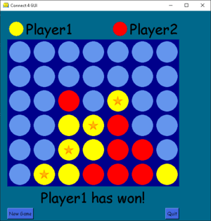
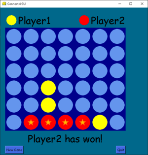
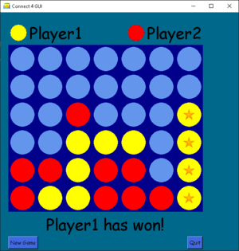

# Connect_4

## Introduction

Connect Four is a two-player connection game in which the players first choose a color and then take turns dropping colored discs from the top into a seven-column, six-row vertically suspended grid. The pieces fall straight down, occupying the next available space within the column.

## Rules

The objective of the game is to be the first to form a horizontal, vertical, or diagonal line of four of one's own discs.

  

## Installation

1. Download or clone this repository.
2. Open the terminal and navigate to the project directory.
3. Run `pip install -r requirements.txt`.

## How to Play

1. Open the terminal and navigate to the project directory.
2. Run `python game.py` to start the game.
3. Click to the column where you want the checker to be placed and the checker will be placed to the next available space within the column.

## Features

- Two-player mode

## Requirements

- Python 3.9
- Pillow library
